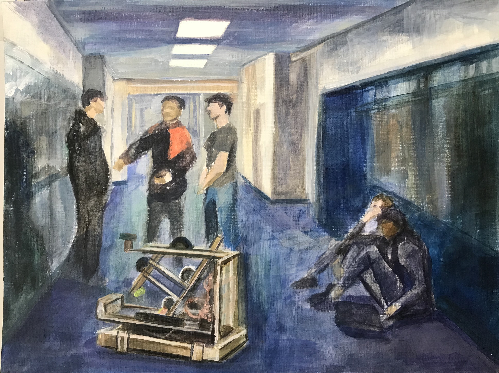
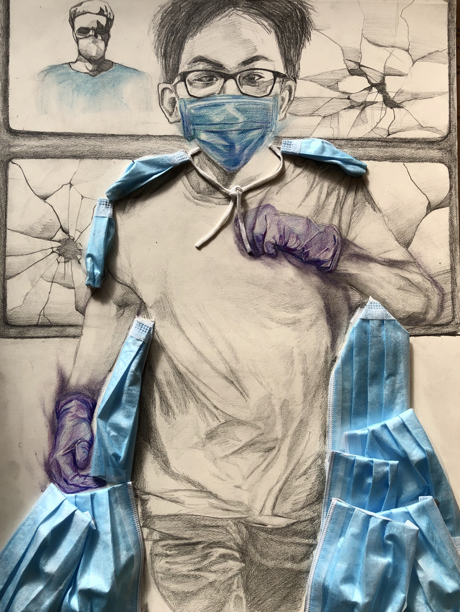
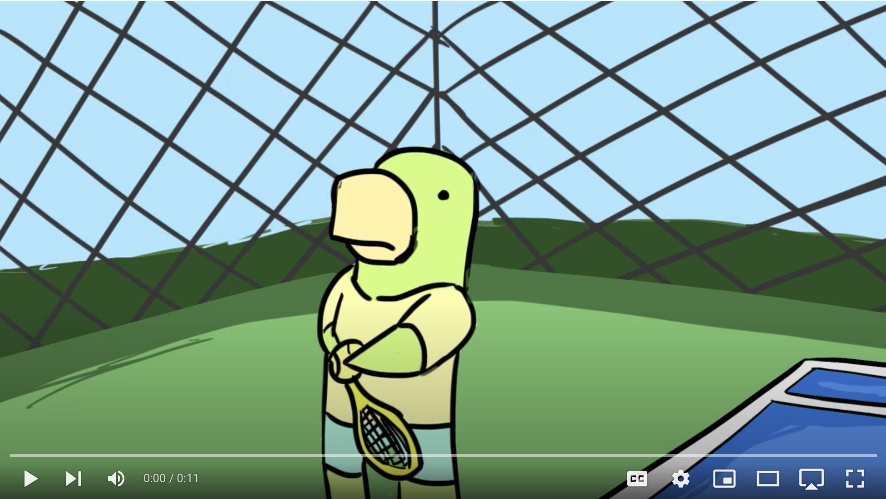
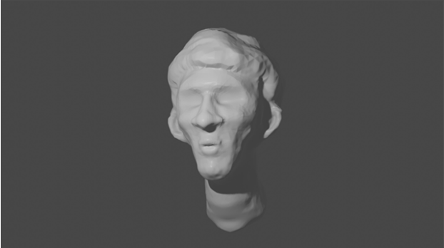
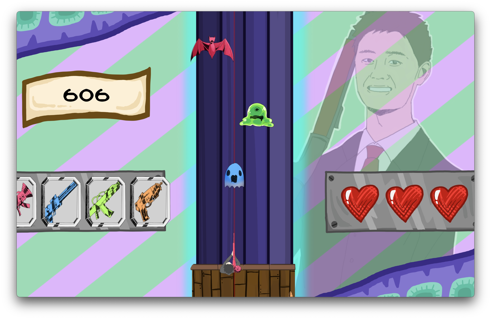
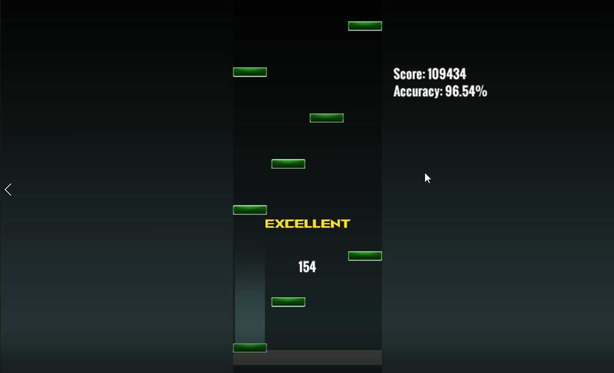
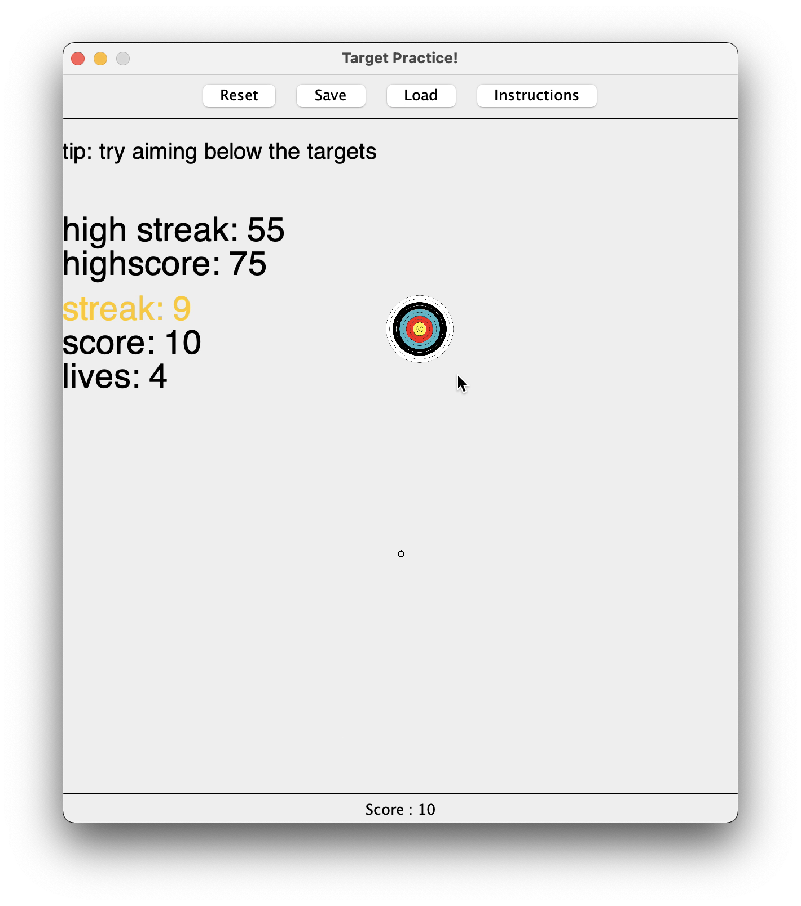

# Art-Portfolio
A repository showcasing my various 2D and 3D art pieces. 

## 2D Art
Here's my collection of drawings and paintings done since 2020.

**Automation, 2021**

**Longing For The Bell, 2021**

**Plugged In, 2021**

**Today's Hero, 2020**

## 2D Animation

## 3D Modeling
A bust inspired by Argentinian soccer player Lionel Messi, done in 2021.

**Leo Mesi**

## Game Screenshots
A collection of screenshots from various videogame projects I've worked on.

**UPGRADE 24 Hour Game Jam project, 2022**

**Senior Project, RhythmPro, 2022**

**Target Practice, made in Swing, 2022**

- Click above to see video demo!

